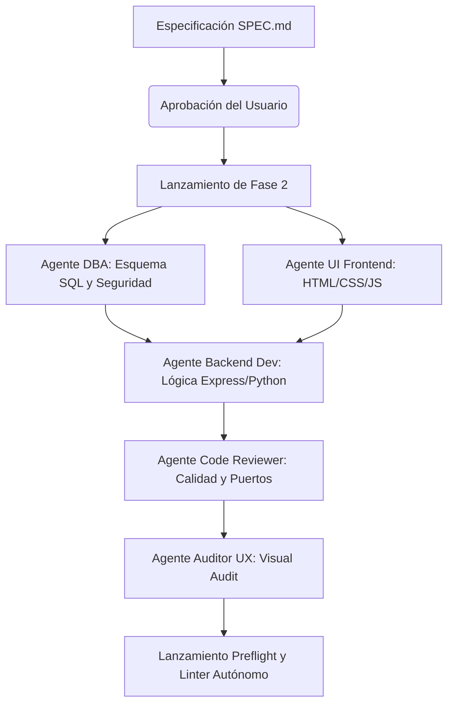

# SQUAD: Orquestador Multi-Agente Local V6

SQUAD es una plataforma avanzada y ligera de desarrollo y orquestación multi-agente diseñada para concebir, diseñar, codificar, depurar y desplegar aplicaciones web completas de forma local y automatizada.

Mediante un enjambre de agentes especializados que colaboran en paralelo, SQUAD transforma una idea en código autoejecutable 100% funcional.

---

## 🚀 Arquitectura y Funcionamiento

SQUAD opera dividiendo el ciclo de vida del desarrollo de software en agentes y fases específicas:



### Componentes Clave:
1. **Agente Arquitecto / Especificación**: Redacta el plan de arquitectura técnica inicial (`SPEC.md`).
2. **Agente DBA**: Diseña esquemas SQL portables compatibles con SQLite y PostgreSQL e inyecta semillas de datos iniciales.
3. **Agente UI/Frontend**: Crea interfaces web premium e interactivas adaptadas a una identidad visual unificada.
4. **Agente Backend Developer**: Implementa las APIs y endpoints del servidor en NodeJS o Python de forma autocontenida.
5. **Agente Code Reviewer**: Verifica que no haya desalineaciones de puertos, NameErrors o dependencias rotas.
6. **Agente Linter Autónomo (Autocuración)**: Ciclo activo de reparación con IA de 3 intentos que lee logs de error y arregla la sintaxis o importaciones en caliente si el servidor crashea al arrancar.
7. **Autocuración de Puertos y Dependencias**: Escanea el código del usuario, inyecta paquetes faltantes a `package.json`/`requirements.txt` automáticamente y redirige puertos hardcodeados al puerto del entorno para evitar bloqueos.

---

## 🛠️ Requisitos Previos

- **Python 3.10+** (con pip)
- **Node.js 18+** y **npm** (para desarrollo del panel de control de la interfaz de SQUAD)
- **Ollama** corriendo localmente (para modelos LLM offline) o API Keys configuradas

---

## 💻 Instalación y Ejecución

### Opción 1: Desarrollo / Modo Completo (Windows / macOS / Linux)

Para arrancar el ecosistema completo (Frontend de monitoreo React/Vite + Servidor FastAPI de backend):

1. **Instalar dependencias del panel frontend:**
   ```bash
   npm install
   ```
2. **Iniciar panel de control frontend (Vite):**
   ```bash
   npm run dev
   ```
   *(Disponible en http://localhost:3000)*

3. **Iniciar servidor de orquestación backend (FastAPI):**
   ```bash
   python squad_local/squad_server.py
   ```
   *(Disponible en http://localhost:8000)*

---

### Opción 2: Despliegue Rápido "One-Click" (Debian i3 u otros Linux)

SQUAD incluye una interfaz optimizada precompilada en el directorio `/dist` que permite arrancarlo en máquinas con bajos recursos (como un procesador Intel i3-7100U con Debian) sin necesidad de configurar Node.js o npm locales:

1. **Clonar e ingresar al directorio:**
   ```bash
   git clone https://github.com/orielmeza22/SQUAD.git
   cd SQUAD
   ```
2. **Dar permisos de ejecución y correr el script auto-instalador:**
   ```bash
   chmod +x setup_debian.sh
   ./setup_debian.sh
   ```
   *El script se encargará de instalar Python 3, crear el entorno virtual, configurar las librerías necesarias e iniciar el servidor en el puerto 8000. Abre `http://localhost:8000` en tu navegador.*

---

## 📁 Estructura del Repositorio

- `squad_local/`: Núcleo de SQUAD. Contiene `squad_server.py` (el motor FastAPI) y archivos de configuración del enjambre.
- `squad_local/SQUAD_WORKSPACE/`: El espacio de ejecución aislado donde SQUAD genera, compila y auto-repara la aplicación del usuario.
- `src/` & `assets/`: Código fuente React/Vite de la interfaz de administración de SQUAD.
- `dist/`: Compilación optimizada lista para producción de la interfaz.
- `setup_debian.sh`: Script instalador automatizado para Linux Debian.
