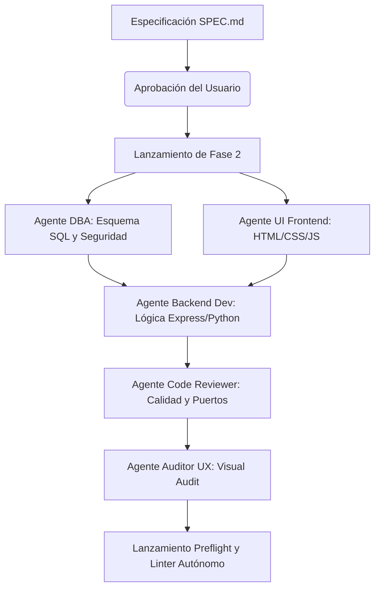

# SQUAD: Orquestador de Enjambres Multi-Agente para Desarrollo Autónomo de Software (V6)

SQUAD es una plataforma de **Ingeniería de Software Autónoma** que permite generar, depurar, compilar y desplegar aplicaciones web funcionales completas (Full-Stack) a partir de una descripción en lenguaje natural. Funciona de manera 100% local (utilizando Ollama para privacidad total) o mediante APIs en la nube (como Google AI Studio).

---

## 🎯 ¿Qué es SQUAD?

SQUAD no es un simple generador de código o autocompletador. Es un **sistema orquestador de agentes autónomos** que simula una célula completa de desarrollo de software (C-Suite, Arquitectos, DBA, Frontend, Backend, QA y DevOps). 

Cada agente tiene un rol asignado y directivas específicas, comunicándose y pasándose el contexto del proyecto en fases sucesivas hasta entregar un software autoejecutable.

---

## 🛠️ ¿Para qué sirve? (Funcionalidad)

El propósito de SQUAD es automatizar el ciclo completo de desarrollo de software desde el prompt inicial:

1. **Diseño de Arquitectura Técnica**: Define la pila tecnológica y el plan detallado de archivos (`SPEC.md`).
2. **Modelado y Seguridad de Base de Datos**: Crea esquemas SQL normalizados (compatibles con SQLite/PostgreSQL) y realiza auditorías de seguridad antes de escribir código.
3. **Desarrollo Frontend Premium**: Genera interfaces web interactivas autocontenidas aplicando sistemas de diseño modernos (Tailwind/CSS3).
4. **Desarrollo Backend Autocontenido**: Programa APIs y servidores web Express/Python con integración de base de datos local y mocks de APIs de terceros.
5. **Autocuración con Linter Autónomo (Self-Healing)**: Si la aplicación falla al arrancar, el orquestador intercepta el error en consola, analiza la traza y llama al Linter Autónomo para que parchee el código en caliente.
6. **Resolución de Conflictos de Puerto y Dependencias**: Modifica archivos de configuración (`package.json`/`requirements.txt`) para instalar dependencias faltantes y redirige puertos hardcodeados dinámicamente.

---

## 🏁 Finalidad y Propósito

La finalidad última de SQUAD es **eliminar la fricción técnica y de infraestructura** al crear software. Permite que:

* **Desarrolladores y Creadores** puedan prototipar ideas de manera ultra-rápida en su máquina local sin lidiar con configuraciones de entornos de base de datos complejas o Docker.
* **Autocuración Inteligente**: El sistema asume la carga cognitiva de depurar errores comunes de sintaxis, dependencias ausentes y malas configuraciones de puertos, garantizando que el entregable sea ejecutable a la primera.
* **Portabilidad Total**: Todo el software generado y la infraestructura de SQUAD están pensados para ser empaquetados y migrados a cualquier servidor (como Debian en arquitecturas antiguas) con un solo clic.

---

## ⚠️ Estado del Proyecto: Fase Beta

> [!WARNING]
> SQUAD se encuentra actualmente en **Fase Beta Activa**. Esto significa que aunque el núcleo de orquestación y autocuración es completamente operativo, se pueden presentar comportamientos inesperados o excepciones de contexto en modelos LLM locales con ventanas de contexto reducidas.

### ¿Qué hay que hacer / Cómo colaborar?
1. **Configurar el Modelo LLM**: Asegúrate de descargar un modelo apto para codificación en Ollama (ej. `qwen2.5-coder:14b` o `qwen2.5-coder:7b`) o configurar tu API Key de Gemini en el archivo `.env` para garantizar la mejor tasa de acierto y respuestas completas.
2. **Reportar Errores**: Si el linter autónomo entra en bucle infinito o no logra resolver un error específico, copia el log de consola de SQUAD y abre un *Issue* en el repositorio.
3. **Contribuir con Prompts/Agentes**: Puedes sugerir mejoras en la lógica de los agentes modificando las directivas del sistema en el archivo `squad_server.py`.

---

## 🚀 Arquitectura del Enjambre



---

## ⚙️ Instalación y Ejecución

### Opción 1: Desarrollo / Modo Completo (Windows / macOS / Linux)

Para arrancar el panel de control frontend y el backend del orquestador:

1. **Instalar dependencias del panel frontend:**
   ```bash
   npm install
   ```
2. **Iniciar panel de control frontend (Vite):**
   ```bash
   npm run dev
   ```
   *(Disponible en http://localhost:3000)*

3. **Iniciar servidor de orquestación backend (FastAPI):**
   ```bash
   python squad_local/squad_server.py
   ```
   *(Disponible en http://localhost:8000)*

---

### Opción 2: Despliegue Rápido "One-Click" (Debian i3 u otros Linux)

SQUAD incluye una interfaz optimizada precompilada en el directorio `/dist` que permite arrancarlo en máquinas con bajos recursos sin necesidad de configurar Node.js o npm locales:

1. **Clonar e ingresar al directorio:**
   ```bash
   git clone https://github.com/orielmeza22/SQUAD.git
   cd SQUAD
   ```
2. **Dar permisos de ejecución y correr el script auto-instalador:**
   ```bash
   chmod +x setup_debian.sh
   ./setup_debian.sh
   ```
   *El script instalará las dependencias del sistema, creará el entorno virtual de Python e iniciará el servidor en el puerto 8000. Abre `http://localhost:8000` en tu navegador.*
